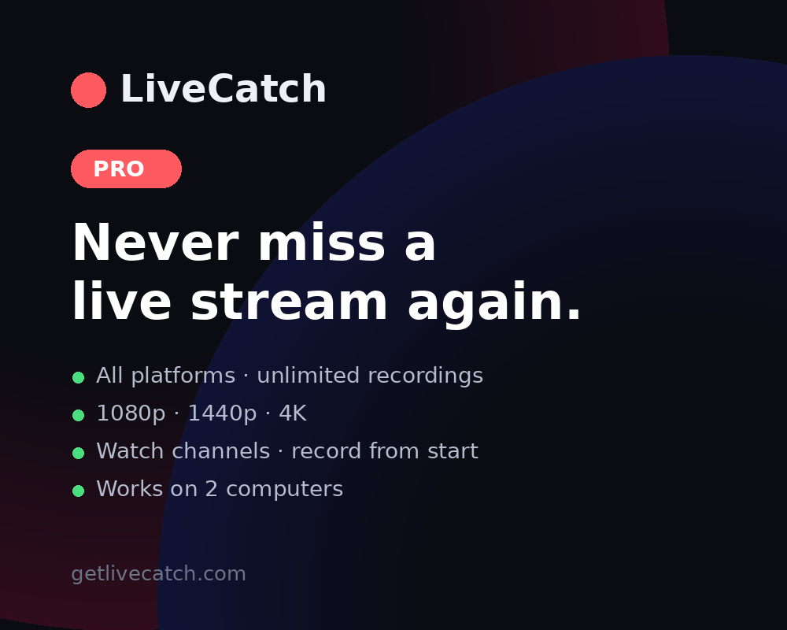

  

<h1 align="center">LiveCatch</h1>

  Record live streams in the background and never miss one. 
  YouTube · Twitch · Kick · TikTok LIVE · Facebook Live

  
  

  
  
  

---

Paste a link. LiveCatch waits until the stream goes live – even if that's at 3 am – records the whole session to your disk, and saves a normal MP4 you can scrub through. No browser window, no cloud, nothing to babysit.

## Why

- A stream you paid for starts while you're asleep or at work.
- Your favourite streamer is in another time zone.
- Platforms delete or trim VODs; you want your own copy.
- You clip streams and need the full source at full quality.

## What it does

| | |
|---|---|
| **Waits for live** | Scheduled YouTube streams show "starts in 12 m"; Twitch / Kick / TikTok channels are polled and recording starts the moment they go live |
| **Records the whole session** | Runs in the background from the system tray; the queue survives a restart |
| **Seekable MP4** | Records crash-safe, then fixes timestamps so you can fast-forward – no re-encode |
| **Quality per recording** | 720p, 1080p, 1440p, 4K or best available |
| **Record from the beginning** | YouTube streams already live are rewound to the start; Twitch fetches the full VOD when the stream ends |
| **Watch a channel** | Re-arms after every stream and records all of them |
| **Simultaneous** | Every link runs independently |
| **Members-only streams** | Optional cookies file |

## Free and Pro

| | Free | Pro |
|---|---|---|
| Platforms | YouTube, Twitch | All |
| Recordings per day | 2 (any length) | Unlimited |
| At the same time | 1 | Unlimited |
| Quality | 720p | up to 4K |
| Watch a channel · record from start · cookies | – | ✔ |

Free needs no account and never expires. Pro is a licence key that works on 2 PCs – see [pricing](https://getlivecatch.com/pricing).

## Install

**Windows 10 / 11, 64-bit.**

1. Download the [installer](https://github.com/VoyD28/livecatch/releases/latest/download/LiveCatch-Setup.exe) (or the [portable zip](https://github.com/VoyD28/livecatch/releases/latest/download/LiveCatch-win64.zip) – unzip anywhere and run `LiveCatch.exe`).
2. Windows may show *"Windows protected your PC"* – that's SmartScreen warning about a new, unsigned app. Click **More info → Run anyway**. You only see it once.
3. Paste a link, click **Add & Watch**. Recordings go to `Videos\LiveCatch`.

If a stream ever fails to record after a platform update, run **Start Menu → LiveCatch → Update yt-dlp and ffmpeg** (portable: `get_tools.bat`). That refreshes the recording engine in seconds.

## Docs and support

- [Documentation & FAQ](https://getlivecatch.com/docs)
- [Support](https://getlivecatch.com/support) · support@getlivecatch.com
- Found a bug? [Open an issue](https://github.com/VoyD28/livecatch/issues) and paste the text from the app's **Log** panel.

## Built with

[yt-dlp](https://github.com/yt-dlp/yt-dlp) and [FFmpeg](https://ffmpeg.org) do the heavy lifting; LiveCatch is the waiting, scheduling, queueing and file-fixing around them, in Python.

## Legal

LiveCatch is a recording tool for personal use. You are responsible for complying with the terms of the platforms you record and with copyright law. YouTube, Twitch, Kick, TikTok and Facebook are trademarks of their respective owners; LiveCatch is not affiliated with or endorsed by them. [Terms](https://getlivecatch.com/terms) · [Privacy](https://getlivecatch.com/privacy)
